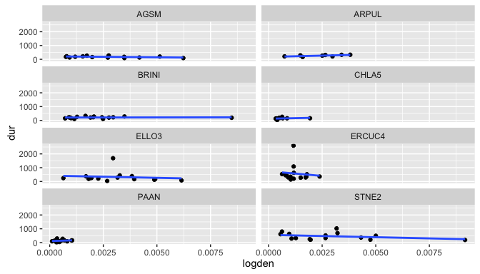

# 2016-summer-data-report
Xiulin Gao  
11/24/2016  
#Main questions

##1. Are there species variations in selected flammability measurements?
According to my interest on ecological effect of grass species may have 
on woody species, selected flammability measurements include: time duration 
when sensored temperatue is above 60 celsius degree (seperated into <10cm
and >10cm sections); total degree of temperature(>60) had been geenrated 
during a burn (<10cm and >10cm); biomass loss rate at flaming and smoldering 
stage seperately(for whole plant, but for different burn stage) and maximum 
flame height(for whole plant).

##2. Does total above ground biomass influence flammability measurements? And how?

##3. Does biomass density at affect measured flammability at >10cm and <10cm section? 

This question will be answered for >10cm and <10cm plant section seperately, because 
I want to exam if biomass allocation will influence measured flammability at two
sections. And the biological implication is heat produced at <10cm has more effect on
reproductive organs of grass, however, heat produced at >10cm has more effect on
neighbors, such as woody species. 

#Code and Results

First of all, obtain all the datsets 

Explanation about all datasets and parameters, see <website >

##1.species variation in interested flammability measurements
###1) species variation in duration
A. >10cm section

```r
durFullMod <- lm( dur ~ logtmass*sp.cd + density*sp.cd, data = temp.abovesec)
durSpNull <- lm( dur ~ logtmass + density, data = temp.abovesec)
anova(durFullMod, durSpNull)
```

```
## Analysis of Variance Table
## 
## Model 1: dur ~ logtmass * sp.cd + density * sp.cd
## Model 2: dur ~ logtmass + density
##   Res.Df     RSS  Df Sum of Sq      F Pr(>F)
## 1     85 5827948                            
## 2    106 7229077 -21  -1401129 0.9731 0.5035
```

<!-- -->

B. <10cm section

```r
dur10FullMod <- lm(dur ~ logtmass*sp.cd + density10*sp.cd, data = temp.belowsec)
dur10SpNull <- lm(dur ~ logtmass + density10, data = temp.belowsec)
anova(dur10FullMod, dur10SpNull)
```

```
## Analysis of Variance Table
## 
## Model 1: dur ~ logtmass * sp.cd + density10 * sp.cd
## Model 2: dur ~ logtmass + density10
##   Res.Df     RSS  Df Sum of Sq      F Pr(>F)  
## 1     85 6438256                              
## 2    106 9486976 -21  -3048721 1.9167 0.0195 *
## ---
## Signif. codes:  0 '***' 0.001 '**' 0.01 '*' 0.05 '.' 0.1 ' ' 1
```

<!-- -->

**Conclusion**  there is species variation in duration at <10cm section

###2)species variation in total degree of temperature(>60)
A. >10cm

```r
degFullMod <- lm(degsec ~ logtmass*sp.cd + density*sp.cd,data = temp.abovesec)
degSpNull <- lm(degsec ~ logtmass + density, data = temp.abovesec)
anova(degFullMod, degSpNull)
```

```
## Analysis of Variance Table
## 
## Model 1: degsec ~ logtmass * sp.cd + density * sp.cd
## Model 2: degsec ~ logtmass + density
##   Res.Df        RSS  Df   Sum of Sq      F  Pr(>F)  
## 1     85 5.6001e+10                                 
## 2    106 7.9829e+10 -21 -2.3828e+10 1.7222 0.04264 *
## ---
## Signif. codes:  0 '***' 0.001 '**' 0.01 '*' 0.05 '.' 0.1 ' ' 1
```
<!-- -->

B. <10cm

```r
deg10FullMod <- lm(degsec ~ logtmass*sp.cd + density10*sp.cd, data = temp.belowsec)
deg10SpNull <- lm(degsec ~ logtmass + density10, data= temp.belowsec)
anova(deg10FullMod, deg10SpNull)
```

```
## Analysis of Variance Table
## 
## Model 1: degsec ~ logtmass * sp.cd + density10 * sp.cd
## Model 2: degsec ~ logtmass + density10
##   Res.Df        RSS  Df   Sum of Sq      F   Pr(>F)   
## 1     85 1.1828e+11                                   
## 2    106 1.9371e+11 -21 -7.5432e+10 2.5813 0.001155 **
## ---
## Signif. codes:  0 '***' 0.001 '**' 0.01 '*' 0.05 '.' 0.1 ' ' 1
```
<!-- -->

**Conclusion**  There is species variation in total degree of temperature(>60) produced
at both >10cm and <10cm sections. 

###3)species variation in maximum flame height

```r
flamhFullMod <- lm(max.fh ~ logtmass*sp.cd + density10*sp.cd +
                     density*sp.cd + height*sp.cd, data=flam.height)
flamhSpNull <- lm(max.fh ~ logtmass + density10 + density + height, data=flam.height)
anova(flamhFullMod, flamhSpNull)
```

```
## Analysis of Variance Table
## 
## Model 1: max.fh ~ logtmass * sp.cd + density10 * sp.cd + density * sp.cd + 
##     height * sp.cd
## Model 2: max.fh ~ logtmass + density10 + density + height
##   Res.Df   RSS  Df Sum of Sq     F Pr(>F)
## 1     84 33190                           
## 2    119 49315 -35    -16125 1.166 0.2803
```
<!-- -->

**Conclusion**  There is no species variation in maximum flame height.

###4)species variation in biomass loss rate
A. Flaming stage

```r
flossFullMod <- lm(lossrate ~ logtmass*sp.cd + density10*sp.cd +
                     density*sp.cd, data = flam.loss)
flossSpNull <- lm(lossrate ~ logtmass + density + density10, data = flam.loss)
anova(flossFullMod, flossSpNull)
```

```
## Analysis of Variance Table
## 
## Model 1: lossrate ~ logtmass * sp.cd + density10 * sp.cd + density * sp.cd
## Model 2: lossrate ~ logtmass + density + density10
##   Res.Df     RSS  Df Sum of Sq      F  Pr(>F)   
## 1     63  8.4832                                
## 2     91 17.3078 -28   -8.8246 2.3406 0.00268 **
## ---
## Signif. codes:  0 '***' 0.001 '**' 0.01 '*' 0.05 '.' 0.1 ' ' 1
```
<!-- -->

B. Smoldering stage

```r
slossFullMod <- lm(lossrate ~ logtmass*sp.cd + density10*sp.cd +
                     density*sp.cd, data = smog.loss)
slossSpNull <- lm(lossrate ~ logtmass + density10 + density, data = smog.loss)
anova(slossFullMod, slossSpNull)
```

```
## Analysis of Variance Table
## 
## Model 1: lossrate ~ logtmass * sp.cd + density10 * sp.cd + density * sp.cd
## Model 2: lossrate ~ logtmass + density10 + density
##   Res.Df     RSS  Df Sum of Sq     F Pr(>F)
## 1     55 0.87488                           
## 2     83 1.49619 -28  -0.62131 1.395 0.1447
```
<!-- -->

**Conclusion** There is variation in biomass loss rate only at flaming stage but not at
smoldering stage. 

##2.Does total biomass affect interested flammability measurements?
###1) biomass effect on duration

A.>10cm

```r
durFullMod <- lm( dur ~ logtmass*sp.cd + density*sp.cd, data = temp.abovesec)
durMaNull <- lm(dur ~ density*sp.cd, data = temp.abovesec)
anova(durFullMod, durMaNull)
```

```
## Analysis of Variance Table
## 
## Model 1: dur ~ logtmass * sp.cd + density * sp.cd
## Model 2: dur ~ density * sp.cd
##   Res.Df     RSS Df Sum of Sq      F    Pr(>F)    
## 1     85 5827948                                  
## 2     93 8209737 -8  -2381788 4.3423 0.0002017 ***
## ---
## Signif. codes:  0 '***' 0.001 '**' 0.01 '*' 0.05 '.' 0.1 ' ' 1
```
<!-- -->

B. <10cm

```r
dur10FullMod <- lm( dur ~ logtmass*sp.cd + density10*sp.cd, data = temp.belowsec)
dur10MaNull <- lm(dur ~ density10*sp.cd, data = temp.belowsec)
anova(dur10FullMod, dur10MaNull)
```

```
## Analysis of Variance Table
## 
## Model 1: dur ~ logtmass * sp.cd + density10 * sp.cd
## Model 2: dur ~ density10 * sp.cd
##   Res.Df      RSS Df Sum of Sq      F    Pr(>F)    
## 1     85  6438256                                  
## 2     93 11277960 -8  -4839705 7.9869 5.724e-08 ***
## ---
## Signif. codes:  0 '***' 0.001 '**' 0.01 '*' 0.05 '.' 0.1 ' ' 1
```
<!-- -->

**Conclusion** There is significant effect of total biomass on duration, positive.

###2)biomass effect on total degree of temperature(>60)

A. >10cm

```r
degFullMod <- lm(degsec ~ logtmass*sp.cd + density*sp.cd, data = temp.abovesec)
degMaNull <- lm(degsec ~ density*sp.cd, data = temp.abovesec)
anova(degFullMod, degMaNull)
```

```
## Analysis of Variance Table
## 
## Model 1: degsec ~ logtmass * sp.cd + density * sp.cd
## Model 2: degsec ~ density * sp.cd
##   Res.Df        RSS Df   Sum of Sq      F    Pr(>F)    
## 1     85 5.6001e+10                                    
## 2     93 9.6942e+10 -8 -4.0942e+10 7.7678 9.049e-08 ***
## ---
## Signif. codes:  0 '***' 0.001 '**' 0.01 '*' 0.05 '.' 0.1 ' ' 1
```
<!-- -->

B.<10cm

```r
deg10FullMod <- lm(degsec ~ logtmass*sp.cd + density10*sp.cd,data = temp.belowsec)
deg10MaNull <- lm(degsec ~ density10*sp.cd, data = temp.belowsec)
anova(deg10FullMod, deg10MaNull)
```

```
## Analysis of Variance Table
## 
## Model 1: degsec ~ logtmass * sp.cd + density10 * sp.cd
## Model 2: degsec ~ density10 * sp.cd
##   Res.Df        RSS Df   Sum of Sq     F    Pr(>F)    
## 1     85 1.1828e+11                                   
## 2     93 2.4063e+11 -8 -1.2235e+11 10.99 1.608e-10 ***
## ---
## Signif. codes:  0 '***' 0.001 '**' 0.01 '*' 0.05 '.' 0.1 ' ' 1
```
<!-- -->

**Conclusion** There is significant biomass effect on total degree of
temperature(>60) produced, positive.

###3)biomass effect on maximum flame height


```r
flamhFullMod <- lm(max.fh ~ logtmass*sp.cd + density10*sp.cd +
                  density*sp.cd + height*sp.cd, data = flam.height)
flamhMaNull <- lm(max.fh ~ density10*sp.cd + density*sp.cd +
                    height*sp.cd, data = flam.height)
anova(flamhFullMod, flamhMaNull)
```

```
## Analysis of Variance Table
## 
## Model 1: max.fh ~ logtmass * sp.cd + density10 * sp.cd + density * sp.cd + 
##     height * sp.cd
## Model 2: max.fh ~ density10 * sp.cd + density * sp.cd + height * sp.cd
##   Res.Df   RSS Df Sum of Sq      F    Pr(>F)    
## 1     84 33190                                  
## 2     92 51964 -8    -18774 5.9395 5.043e-06 ***
## ---
## Signif. codes:  0 '***' 0.001 '**' 0.01 '*' 0.05 '.' 0.1 ' ' 1
```
<!-- -->

**Conclusion** There is significant biomass influence on maximum flame height, 
positive.

###4) biomass effect on biomass loss rate at two stages

A. Flaming stage

```r
flossFullMod <- lm(lossrate ~ logtmass*sp.cd + density10*sp.cd +
                     density*sp.cd, data = flam.loss)
flossMaNull <- lm(lossrate ~ density*sp.cd + density10*sp.cd,
                  data = flam.loss)
anova(flossFullMod, flossMaNull)
```

```
## Analysis of Variance Table
## 
## Model 1: lossrate ~ logtmass * sp.cd + density10 * sp.cd + density * sp.cd
## Model 2: lossrate ~ density * sp.cd + density10 * sp.cd
##   Res.Df     RSS Df Sum of Sq      F    Pr(>F)    
## 1     63  8.4832                                  
## 2     71 16.7134 -8   -8.2302 7.6402 4.351e-07 ***
## ---
## Signif. codes:  0 '***' 0.001 '**' 0.01 '*' 0.05 '.' 0.1 ' ' 1
```
<!-- -->

B. Smoldering stage

```r
slossFullMod <- lm(lossrate ~ logtmass*sp.cd + density10*sp.cd +
                     density*sp.cd, data = smog.loss)
slossMaNull <- lm(lossrate ~ density10*sp.cd + density*sp.cd,
                  data = smog.loss)
anova(slossFullMod, slossMaNull)
```

```
## Analysis of Variance Table
## 
## Model 1: lossrate ~ logtmass * sp.cd + density10 * sp.cd + density * sp.cd
## Model 2: lossrate ~ density10 * sp.cd + density * sp.cd
##   Res.Df     RSS Df Sum of Sq      F  Pr(>F)  
## 1     55 0.87488                              
## 2     63 1.12783 -8  -0.25296 1.9878 0.06518 .
## ---
## Signif. codes:  0 '***' 0.001 '**' 0.01 '*' 0.05 '.' 0.1 ' ' 1
```
<!-- -->

**Conclusion** There is significant biomass influence on biomass loss rate at both
flaming and smoldering stage, however, seems it is not always positive effect. 
there is some negative effect on mass loss rate at smoldering stage.

##3.Does biomass density affect interested flammability measurements?
###1) biomass density effect on duration
A. >10cm

```r
durFullMod <- lm( dur ~ logtmass*sp.cd + density*sp.cd, 
                  data = temp.abovesec)
durDenNull <- lm(dur ~ logtmass*sp.cd, data = temp.abovesec)
anova(durFullMod, durDenNull)
```

```
## Analysis of Variance Table
## 
## Model 1: dur ~ logtmass * sp.cd + density * sp.cd
## Model 2: dur ~ logtmass * sp.cd
##   Res.Df     RSS Df Sum of Sq      F Pr(>F)
## 1     85 5827948                           
## 2     93 5877599 -8    -49650 0.0905 0.9994
```
<!-- -->

B.<10cm

```r
dur10FullMod <- lm( dur ~ logtmass*sp.cd + density10*sp.cd, 
                    data = temp.belowsec)
dur10DenNull <- lm(dur ~ logtmass*sp.cd, data = temp.belowsec)
anova(dur10FullMod, dur10DenNull)
```

```
## Analysis of Variance Table
## 
## Model 1: dur ~ logtmass * sp.cd + density10 * sp.cd
## Model 2: dur ~ logtmass * sp.cd
##   Res.Df     RSS Df Sum of Sq      F Pr(>F)
## 1     85 6438256                           
## 2     93 6722781 -8   -284525 0.4695 0.8744
```
<!-- -->

**Conclusion** There is no inlfuence of biomass density on duration

###2) biomass density effect on total degree of temperature(>60) 
A. >10cm

```r
degFullMod <- lm(degsec ~ logtmass*sp.cd + density*sp.cd,
                 data = temp.abovesec)
degDenNull <- lm(degsec ~ logtmass*sp.cd, data = temp.abovesec)
anova(degFullMod, degDenNull)
```

```
## Analysis of Variance Table
## 
## Model 1: degsec ~ logtmass * sp.cd + density * sp.cd
## Model 2: degsec ~ logtmass * sp.cd
##   Res.Df        RSS Df  Sum of Sq      F Pr(>F)
## 1     85 5.6001e+10                            
## 2     93 5.7829e+10 -8 -1.828e+09 0.3468 0.9448
```
<!-- -->

B.<10cm

```r
deg10FullMod <- lm(degsec ~ logtmass*sp.cd + density10*sp.cd,
                   data = temp.belowsec)
deg10DenNull <- lm(degsec ~ logtmass*sp.cd, data = temp.belowsec)
anova(deg10FullMod, deg10DenNull)
```

```
## Analysis of Variance Table
## 
## Model 1: degsec ~ logtmass * sp.cd + density10 * sp.cd
## Model 2: degsec ~ logtmass * sp.cd
##   Res.Df        RSS Df   Sum of Sq      F Pr(>F)
## 1     85 1.1828e+11                             
## 2     93 1.2506e+11 -8 -6778490283 0.6089  0.768
```
<!-- -->

**Conclusion** There is no significant biomass density effect on total 
degree of temperature(>60) produced

###3) biomass density effect on maximum flame height
A. biomass density at >10cm

```r
flamhFullMod <- lm(max.fh ~ logtmass*sp.cd + density10*sp.cd +
                     density*sp.cd + height*sp.cd, data = flam.height)
flamhDenNull <- lm(max.fh ~ logtmass*sp.cd + density10*sp.cd + 
                    height*sp.cd, data = flam.height)
anova(flamhFullMod, flamhDenNull)
```

```
## Analysis of Variance Table
## 
## Model 1: max.fh ~ logtmass * sp.cd + density10 * sp.cd + density * sp.cd + 
##     height * sp.cd
## Model 2: max.fh ~ logtmass * sp.cd + density10 * sp.cd + height * sp.cd
##   Res.Df   RSS Df Sum of Sq      F Pr(>F)
## 1     84 33190                           
## 2     92 34189 -8   -999.63 0.3162 0.9579
```
<!-- -->

B. biomass density at <10cm

```r
flamhFullMod <- lm(max.fh ~ logtmass*sp.cd + density10*sp.cd +
                     density*sp.cd + height*sp.cd, data = flam.height)
flamhDen10Null <- lm(max.fh ~ logtmass*sp.cd + density*sp.cd + 
                    height*sp.cd, data = flam.height)
anova(flamhFullMod, flamhDen10Null)
```

```
## Analysis of Variance Table
## 
## Model 1: max.fh ~ logtmass * sp.cd + density10 * sp.cd + density * sp.cd + 
##     height * sp.cd
## Model 2: max.fh ~ logtmass * sp.cd + density * sp.cd + height * sp.cd
##   Res.Df   RSS Df Sum of Sq      F Pr(>F)
## 1     84 33190                           
## 2     92 36481 -8   -3291.7 1.0414 0.4121
```
<!-- -->

**Conclusion** There is no significant biomass density influence on maximum
flame height

###4) biomass density effect on biomass loss rate at two stages
A. Flaming stage
density at >10cm 

```r
flossFullMod <- lm(lossrate ~ logtmass*sp.cd + density10*sp.cd +
                     density*sp.cd, data = flam.loss)
flossDenNull <- lm(lossrate ~ logtmass*sp.cd + density10*sp.cd,
                  data = flam.loss)
anova(flossFullMod, flossDenNull)
```

```
## Analysis of Variance Table
## 
## Model 1: lossrate ~ logtmass * sp.cd + density10 * sp.cd + density * sp.cd
## Model 2: lossrate ~ logtmass * sp.cd + density10 * sp.cd
##   Res.Df    RSS Df Sum of Sq      F Pr(>F)
## 1     63 8.4832                           
## 2     71 9.1318 -8  -0.64864 0.6021 0.7726
```
<!-- -->

density at <10cm

```r
flossFullMod <- lm(lossrate ~ logtmass*sp.cd + density10*sp.cd +
                     density*sp.cd, data = flam.loss)
flossDen10Null <- lm(lossrate ~ logtmass*sp.cd + density*sp.cd,
                  data = flam.loss)
anova(flossFullMod, flossDen10Null)
```

```
## Analysis of Variance Table
## 
## Model 1: lossrate ~ logtmass * sp.cd + density10 * sp.cd + density * sp.cd
## Model 2: lossrate ~ logtmass * sp.cd + density * sp.cd
##   Res.Df    RSS Df Sum of Sq      F Pr(>F)
## 1     63 8.4832                           
## 2     71 8.8902 -8  -0.40701 0.3778 0.9285
```
<!-- -->

B. Smoldering stage
density at >10cm

```r
slossFullMod <- lm(lossrate ~ logtmass*sp.cd + density10*sp.cd +
                     density*sp.cd, data = smog.loss)
slossDenNull <- lm(lossrate ~ density10*sp.cd + logtmass*sp.cd,
                  data = smog.loss)
anova(slossFullMod, slossDenNull)
```

```
## Analysis of Variance Table
## 
## Model 1: lossrate ~ logtmass * sp.cd + density10 * sp.cd + density * sp.cd
## Model 2: lossrate ~ density10 * sp.cd + logtmass * sp.cd
##   Res.Df     RSS Df Sum of Sq      F Pr(>F)
## 1     55 0.87488                           
## 2     63 0.89935 -8 -0.024477 0.1924 0.9909
```
<!-- -->

density at <10cm

```r
slossFullMod <- lm(lossrate ~ logtmass*sp.cd + density10*sp.cd +
                     density*sp.cd, data = smog.loss)
slossDen10Null <- lm(lossrate ~ density*sp.cd + logtmass*sp.cd,
                  data = smog.loss)
anova(slossFullMod, slossDen10Null)
```

```
## Analysis of Variance Table
## 
## Model 1: lossrate ~ logtmass * sp.cd + density10 * sp.cd + density * sp.cd
## Model 2: lossrate ~ density * sp.cd + logtmass * sp.cd
##   Res.Df     RSS Df Sum of Sq   F Pr(>F)
## 1     55 0.87488                        
## 2     63 0.98941 -8  -0.11453 0.9  0.523
```
<!-- -->

**Conclusion** Thers is no biomss density effect on biomass loss rate
Therefore, seems biomass density has no influence on flammability at all...

###5) if plant height affects maximum flame height

```r
flamhFullMod <- lm(max.fh ~ logtmass*sp.cd + density10*sp.cd +
                     density*sp.cd + height*sp.cd, data = flam.height)
flamhHeiNull <- lm(max.fh ~ logtmass*sp.cd + density*sp.cd +
                     density10*sp.cd, data = flam.height)
anova(flamhFullMod, flamhHeiNull)
```

```
## Analysis of Variance Table
## 
## Model 1: max.fh ~ logtmass * sp.cd + density10 * sp.cd + density * sp.cd + 
##     height * sp.cd
## Model 2: max.fh ~ logtmass * sp.cd + density * sp.cd + density10 * sp.cd
##   Res.Df   RSS Df Sum of Sq      F Pr(>F)
## 1     84 33190                           
## 2     92 37364 -8   -4174.9 1.3208 0.2445
```
<!-- -->

**Conclusion** Plant height does not have effect on maximum flame height.

